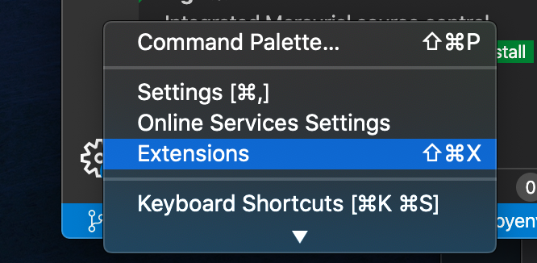
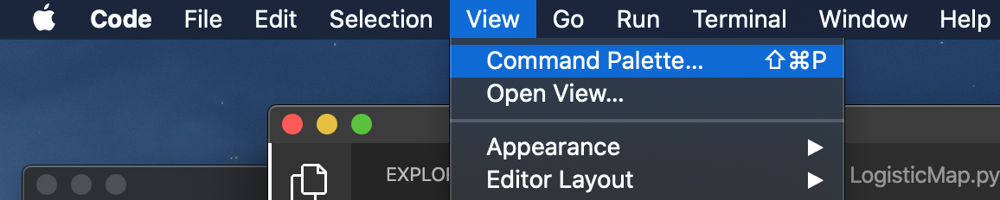
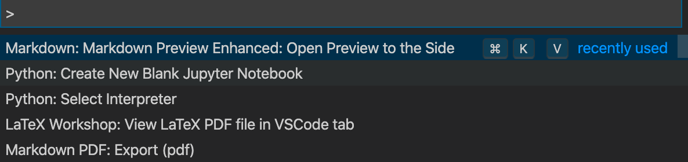

# 講義内容について

最近の理論化学・物理はほぼほぼシミュレーションを必要とします。
シミュレーションをするにはある程度プログラミングの知識があったほうがよいですし、
シュミュレーションで出てくる結果を解析するのを人力でやるのはあまりにも大変なので簡単な処理スクリプトは書けたほうがよいです。
また、最近は実験もオートメーション化も進められていますし、今後実験の人もプログラムができるとなにかと便利だと思います。
というわけで、今回の基礎物理化学IIではちょっとしたプログラム作成と数値シミュレーションで親しむ物理化学の基礎、という方向性で行きたいと思います。

# 評価方法
講義中に実習課題を出すので、それの実行結果を実習時間中に見せるか、後でスクショ等で送ってください。

# シミュレーションのための環境
世にプログラミング言語はあれこれあるのですが、今回はひとまずpythonを使ってみたいと思います。pythonは1990年代初頭にグイド・ヴァンロッサムによって開発されたプログラミング言語の一つでシンプルでありながら豊富な機能をもつインタープリタ型言語です。言語そのものの便利さもですが、開発者が多く、多数のライブラリが備わっているので、ちょっと複雑なことをしたい時でもライブラリをインポートするだけでいろんなことができるのが一番の利点でしょう。代表的なものでは数値計算ライブラリの`numpy` や機械学習の`scikit-learn`などがあります。

まずはこのpythonを皆さんのPCで動かせるようにしましょう。

## Windows
Windowsでpython環境をすべて自前でセットアップするのはたまに落とし穴があったりして時間がかかることがあります。上記のライブラリが何故かインストールできなかったりなどのトラブルもよく起きます。なので、よく使うライブラリからpython用のエディタまでがすべてまとめられた便利なソフトウェアを使う方が手軽です。

よく知られているものの一つが `WinPython` です。

配布元はいくつかあるのですが、自分は

https://sourceforge.net/projects/winpython/
の
https://sourceforge.net/projects/winpython/files/WinPython_3.8/3.8.3.0/Winpython64-3.8.3.0.exe/download　
で試しました。
自分のハードウェア（64bit or 32bit）に合うものをダウンロードしてください。
かなりファイルが重いので自宅などで回線が細くて時間がかかる人は、ひとまず後述の`Google Colaboratory` などでpythonを動かしてみるといいと思います。
ダウンロード＆インストールするときに、どのフォルダにインストールされたかはメモしておきましょう。（インストールの途中にどこに保存するか聞かれるので、そこでわかりやすい場所にしておくと良いかと思います）
`WinPython`には`Spyder`というプログラムのエディタと、そこでの実行結果の表示が一体になった統合開発環境が同梱されてます。
開くとこんな感じになるかと思います↓


## Mac
Macにはデフォルトでpythonが入ってます。ただ、バージョンが古いです。（通常2.x系が入っている。）まずは、LaunchPad --> その他　にある `ターミナル`　を開いて、pythonがあることの確認をまずしましょう。

こんな画面が出てくると思うので、
```
python --version
```
と打って、pythonのコマンドが認識されているか、バージョンがいくつのものが入っているかを確認します。

文法などが少し違うので、python 3.x系をインストールしておきます。
（もし上記の`python --version` で `Python 3.6.X` のような表示が返ってきてpython 3.x系が入っているようならこの手続は不要です）

### homebrewを使ったインストール
Macで様々なもののインストールと管理を容易にする`homebrew`はpythonのインストールもすごく楽にしてくれます。
https://brew.sh/index_ja.html　
に手続きが書かれていますが、先程開いたと思うターミナルに

```
/bin/bash -c "$(curl -fsSL https://raw.githubusercontent.com/Homebrew/install/master/install.sh)"
```
を貼り付けて実行します。
一通り手続きが終わった後、
```
brew doctor
```
と打って
```
Your system is ready to brew.
```
なら問題ないです。
`homebrew`を入れ終わったら、
```
brew install python3
```
で3.x系のpythonを入れてください。
今回は`numpy` と`matplotlib`も使うので、python3に付随してくる`pip3`でそれらのライブラリもインストールしておきます。
```
pip3 install numpy 
pip3 install matplotlib 
```
### 開発環境
WinPythonとちがって、Macでの上記手順ではエディタ（プログラムを書くツール）は自分で調達しないといけません。
気合でテキストエディットで書くという手もありますが、サポートが充実している専用ツールを使ったほうが快適でしょう。
使ってみた感じ、`VScode`か`PyCharm`が便利です。とりあえず`VScode`を紹介しておきます。
`VScode` のインストール自体は
https://code.visualstudio.com/
からOSに合うものを入れれば完了です。
スクショ入りで手順を書いてくれてる人もいます。
https://qiita.com/watamura/items/51c70fbb848e5f956fd6

pythonの拡張機能を入れると、Jupyter notebookも開けます。拡張機能はVScodeの左下のボタンを押して出てくるメニューから
Extensionsを押してクリックすると拡張機能管理画面が左側に立ち上がるので、pythonで検索してMicrosoft純正のpython用拡張機能を入れます。



pythonのファイル（拡張子.py）やJupyter notebook（拡張子.ipynb）を認識すると
自動でこの拡張機能がオンになりますが、pythonの実行環境を選ぶ必要があるかもしれません。
その場合、View-> command palletから



コマンドの入力画面を開いて、



```
Python: Select interpreter
```
を入力して適したpython3系の実行環境を指定してください。

# Linux
個人で使うPCのOSがLinuxという猛者にはpython環境のセットアップなど個別に説明しなくても大丈夫でしょう。
`yum install` なり `sudo apt-get install`　なりで入れてください。 

# なんか設定うまく行かない！とにかく手早く使ってみたい！
`Google Colaboratory` を使いましょう。
https://colab.research.google.com/notebooks/

Googleアカウント持っていれば、なんも設定無しでブラウザ上でpythonの実行ができます。
資料のコードをコピー＆ペーストすれば下図のように動きます。


# 資料について
各項目のサンプルコードと資料はJupyter Notebook形式で書いています。
github上でレンダリングされてグラフ等も出力されるはずですが、たまにうまく行かなかったり、数式が崩れたりするのでその場合は
https://nbviewer.jupyter.org/
に各資料のURLをいれて表示させてください。
gitが使えるなら、自分のPC上の適当な空のフォルダで、
```
git clone git@github.com:eminamitani/lecture-ims.git
```
のコマンドで資料のファイルをすべて手元に落としてきてVScodeのpython拡張を使うなどして、
Jupyter notebookとして開いて確認するのも手っ取り早いです。

内容としては
1.  Python最低限の文法リスト　　https://github.com/eminamitani/lecture-ims/blob/master/PythonMinimum.ipynb
2. ロジスティック写像のシミュレーション　　https://github.com/eminamitani/lecture-ims/blob/master/LogisticMap.ipynb
3. イジング模型のモンテカルロシミュレーション　https://github.com/eminamitani/lecture-ims/blob/master/MonteCarlo.ipynb
4. グラフェンの強束縛模型計算　https://github.com/eminamitani/lecture-ims/blob/master/Graphene.ipynb

を用意してあります。
課題は2.ロジスティック写像と3.モンテカルロシミュレーションの箇所に用意してあります。
講義は一通りの説明をしますが、その後は自分のペースでサンプルコードを動かしたり、
それを元に課題を進めてください。
