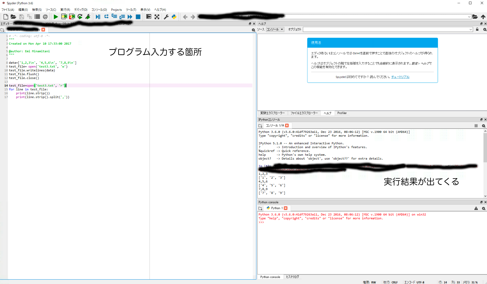
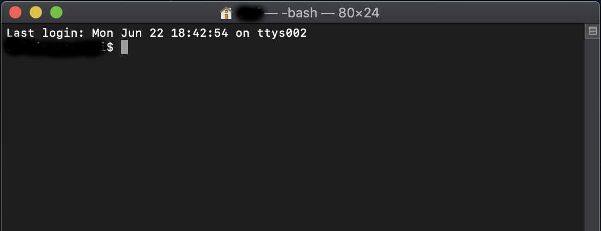

# 講義内容について

最近の理論化学・物理はほぼほぼシミュレーションを必要とします。
シミュレーションをするにはある程度プログラミングの知識があったほうがよいですし、
シュミュレーションで出てくる結果を解析するのを人力でやるのはあまりにも大変なので簡単な処理スクリプトは書けたほうがよいです。
また、最近は実験もオートメーション化なども進められていますし、今後実験の人もプログラムができるとなにかと便利だと思います。
というわけで、今回の基礎物理化学IIではちょっとしたプログラム作成と数値シミュレーションで親しむ物理化学の基礎、という方向性で行きたいと思います。

# 評価方法
講義中に実習課題を出すので、それの実行結果を元にレポートを提出してもらいます。

# シミュレーションのための環境
世にプログラミング言語はあれこれあるのですが、今回はひとまずpythonを使ってみたいと思います。pythonは1990年代初頭にグイド・ヴァンロッサムによって開発されたプログラミング言語の一つでシンプルでありながら豊富な機能をもつインタープリタ型言語です。言語そのものというよりは、開発者が多く、多数のライブラリが備わっているので、ちょっと複雑なことをしたい時でもライブラリをインポートするだけでいろんなことができます。代表的なものでは数値計算ライブラリの`numpy` や機械学習の`scikit-learn`などがあります。

まずはこのpythonを皆さんのPCで動かせるようにしましょう。

## Windows
Windowsでpython環境をすべて自前でセットアップするのはたまに落とし穴があったりして時間がかかることがあります。上記のライブラリが何故かインストールできなかったりなどのトラブルもよく起きます。なので、よく使うライブラリからpython用のエディタまでがすべてまとめられた便利なソフトウェアを使う方が手軽です。

よく知られているものの一つが `WinPython` です。

https://winpython.github.io/　
から
WinPython 3.7 Downloadsのリンクに進み　https://github.com/winpython/winpython/releases/tag/2.3.20200530　　
の下の方にある`Assets`部分から自分のハードウェア（64bit or 32bit）に合うものをダウンロードしてください。
ダウンロード＆インストールするときに、どのフォルダにインストールされたかはメモしておきましょう。（インストールの途中にどこに保存するか聞かれるので、そこでわかりやすい場所にしておくと良いかと思います）
`WinPython`には`Spyder`というプログラムのエディタと、そこでの実行結果の表示が一体になった統合開発環境が同梱されてます。
開くとこんな感じになるかと思います↓




## Mac
Macにはデフォルトでpythonが入ってます。ただ、バージョンが古い（たぶん2.x系が入っている）LaunchPad --> その他　にある `ターミナル`　を開いて、pythonがあることの確認をまずしましょう。

こんな画面が出てくると思うので、
```
python --version
```
と打って、pythonのコマンドが認識されているか、バージョンがいくつのものが入っているかを確認します。

文法などが少し違うので、python 3.x系をインストールをインストールしておきます。
（もし上記の`python --version` で `Python 3.6.X` のような表示が返ってきてpython 3.x系が入っているようならこの手続は不要です）

### homebrewを使ったインストール
Macで様々なもののインストールと管理を容易にする`homebrew`はpythonのインストールもすごく楽にしてくれます。
https://brew.sh/index_ja.html　
に手続きが書かれていますが、先程開いたと思うターミナルに

```
/bin/bash -c "$(curl -fsSL https://raw.githubusercontent.com/Homebrew/install/master/install.sh)"
```
を貼り付けて実行します。
一通り手続きが終わった後、
```
brew doctor
```
と打って
```
Your system is ready to brew.
```
なら問題ないです。
`homebrew`を入れ終わったら、
```
brew install python3
```
で3.x系のpythonを入れてください。
